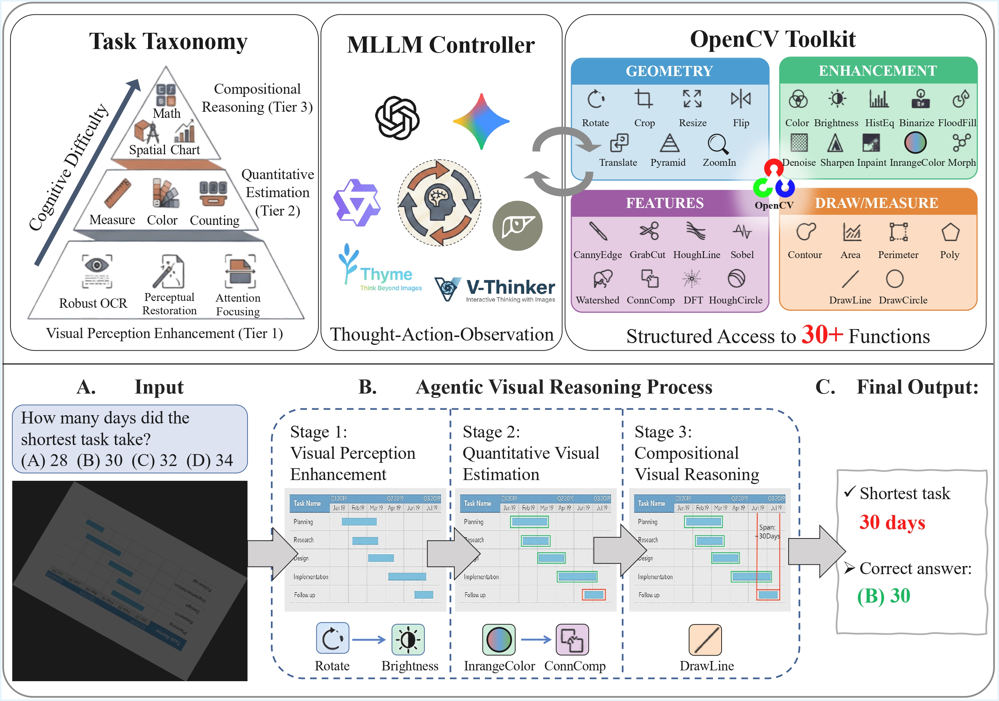
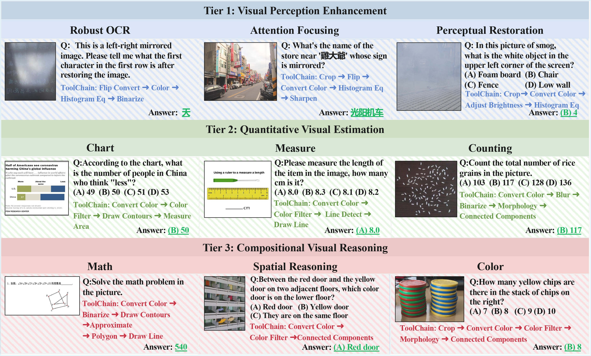

<div align="center">

</div>

# VTC-Bench: Evaluating Agentic Multimodal Models via Compositional Visual Tool Chaining

<div align="center">

**arXiv Paper:** [](https://arxiv.org/abs/2603.15030) &nbsp;&nbsp;&nbsp; **Dataset:** [](https://huggingface.co/datasets/zzzhu/VTC-Bench) 

</div>

---

## 📢 News
- **[2026/03/16]** We are thrilled to introduce **VTC-Bench**, a comprehensive benchmark designed to rigorously evaluate the advanced tool-use proficiency and multi-tool composition capabilities of Multimodal Large Language Models (MLLMs). 🎉 



## 📌 Introduction

- Recent advancements have extended Multimodal Large Language Models (MLLMs) beyond standard visual question answering to utilizing external tools for advanced visual tasks, effectively transforming them into active, agentic problem solvers. 
- Despite this progress, accurately executing and effectively composing diverse tools for complex visual tasks remains a persistent bottleneck. Existing benchmarks are often constrained by sparse tool-sets and simple tool-use trajectories, failing to capture the complex tool interactions required in practical, real-world conditions.
- To bridge this critical gap, we introduce **Visual Tool Chain-Bench (VTC-Bench)**. To emulate authentic computer vision pipelines, our framework integrates **32 diverse OpenCV-based visual operations**.
- VTC-Bench features **680 curated problems** structured across a progressive nine-category cognitive hierarchy. A key feature of our benchmark is that every problem is paired with a **ground-truth execution trajectory** to enable the precise evaluation of both intermediate planning and final outcomes.
- Extensive experiments on 19 leading MLLMs reveal that even the top-performing model (Gemini-3.0-Pro) only achieves 51.2% on our benchmark, highlighting that multi-tool composition remains a persistent challenge and models often rely on suboptimal heuristics rather than optimal tool selection.

## 🔍 Benchmark Overview

VTC-Bench is organized into a three-tier cognitive hierarchy that maps the evolution of multimodal agents from passive visual sensing to active constructive reasoning:

1. **Tier 1: Visual Perception Enhancement:** Foundational tasks including Robust OCR, Perceptual Restoration, and Attention Focusing. These require models to mitigate environmental interference and rectify geometric distortions.
2. **Tier 2: Quantitative Visual Estimation:** Tasks including Measurement, Color, and Counting. These evaluate the model's capacity to perceive and precisely quantify physical attributes.
3. **Tier 3: Compositional Visual Reasoning:** Advanced tasks including Chart, Math, and Spatial Reasoning. These demand complex logical deduction through multi-step tool orchestration and auxiliary construction.
   


## ✨ Evaluation Pipeline

VTC-Bench supports evaluating models across two distinct tool-use interaction paradigms:

### 📍 Track A: Code Interpreter (Code-Driven)
- In this track, the agent utilizes a code interpreter to synthesize Python code for visual manipulation. 
- Models must generate programmatic solutions using raw OpenCV (`cv2`) code based on a strictly provided list of allowed capabilities and parameter logic.

### 📍 Track B: Atomic OpenCV Toolbox (Interface-Driven)
- In this track, the agent interacts iteratively with predefined interfaces from a suite of 32 distinct tools (categorized into Geometry, Enhancement, Feature Extraction, and Drawing).
- We utilize frameworks like Qwen-Agent (for models with native tool-calling) or Thyme (for generating code/interfaces for open-source models) to manage the reasoning and execution layer.

## 🚀 Quick Start / Evaluation Usage

Follow these steps to quickly set up the environment and run evaluations on VTC-Bench:

1. **Install the `qwen-agent` environment:**
   ```bash
   pip install -U qwen-agent
   ```

2. **Modify the configuration file:**
   Update the evaluation settings (e.g., model API keys, paths) in the YAML configuration file according to your setup.
   ```text
   ./eval_config/gpt_4o_interface.yaml
   ```

3. **Run the evaluation script:**
   Execute the evaluation pipeline using the configured YAML file.
   ```bash
   python VTC_Bench_Eval.py -c ./eval_config/gpt_4o_interface.yaml
   ```

## 💡 Representative Examples of Each Task

VTC-Bench evaluates models across 9 diverse tasks requiring complex toolchaining:
- **Attention Focusing:** Re-orienting focus via spatial normalization (e.g., Rotate, Crop, Convert Color, Binarize).
- **Chart:** Simultaneous restoration, perception, and inference of chart data.
- **Color:** Quantifying color proportions using chromatic space manipulations.
- **Counting:** Overcoming visual occlusion using morphological utilities for "segment-and-count" pipelines.
- **Math:** STEM-oriented geometric reasoning requiring auxiliary lines.
- **Measurement:** Sub-pixel precision physical dimension estimation.
- **Perceptual Restoration:** Neutralizing haze and noise to recover semantic info.
- **Robust OCR:** Strategic planning to binarize and sharpen before text recognition under compound degradation.
- **Spatial Reasoning:** Transforming visual cues into precise spatial coordinates.

## 📚 Citation
If you find our benchmark useful for your research, please consider citing our paper:
```bibtex
@misc{zhu2026vtcbench,
      title={VTC-Bench: Evaluating Agentic Multimodal Models via Compositional Visual Tool Chaining}, 
      author={Xuanyu Zhu and Yuhao Dong and Rundong Wang and Yang Shi and Zhipeng Wu and Yinlun Peng and YiFan Zhang and Yihang Lou and Yuanxing Zhang and Ziwei Liu and Yan Bai and Yuan Zhou},
      year={2026},
      eprint={2603.15030},
      archivePrefix={arXiv},
      primaryClass={cs.AI},
      url={[https://arxiv.org/abs/2603.15030](https://arxiv.org/abs/2603.15030)}, 
}
